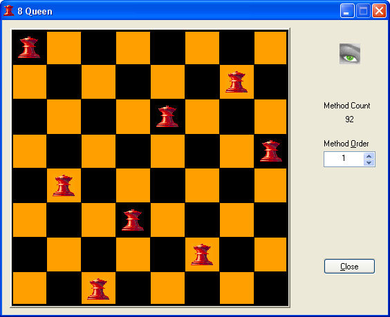

#  8 Queen

Eight queens problem in mathematics.
The task is to place 8 queens on the chessboard without them attacking each other.
The program finds all (92) solutions to this problem and displays them visually.

created in 2000

Teck stack: C++, MFC

**Screenshot**

